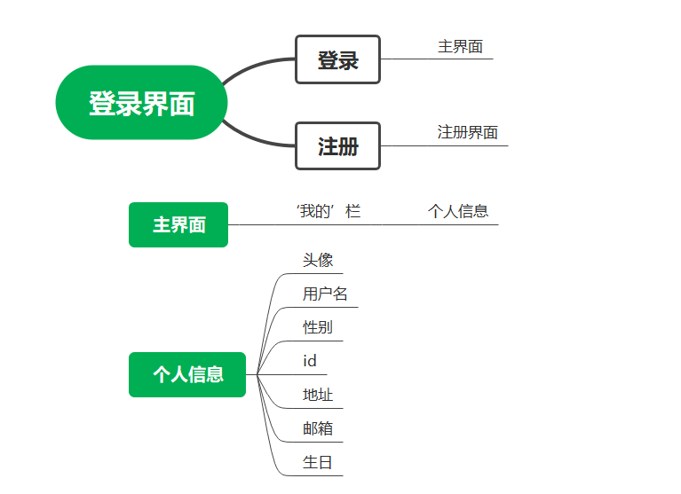
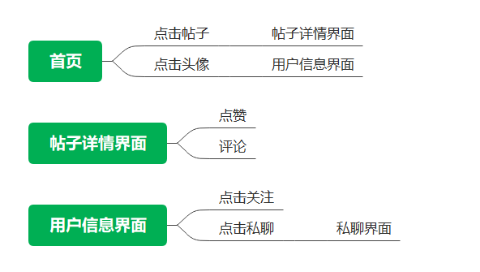
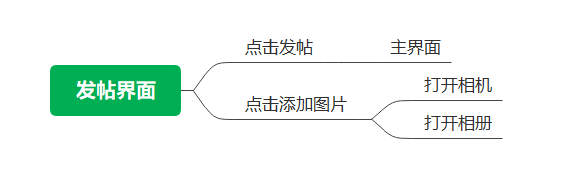
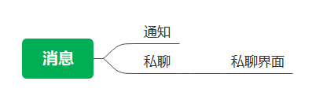

title: SchoolCircle校友圈——基于Android

author:
  - 傅嘉豪(1912190318)
  - 谷宁宁(1912190319)
  - 马辰杰(1912190320)

description: |

  我们开发了一个android app，实现校园内各种信息分享，
  前端使用Android studio开发，后端采用
  主要实现文字与图片以帖子形式分享以及一些其他功能（后续文档中详细介绍）

# 一、项目介绍 [傅嘉豪、谷宁宁、马辰杰]

## 背景
这是一个包含交友、记录等功能的校园类社交APP。目前网络上的论坛五花八门，各种功能的论坛应应有尽有，但是我们发现很多关于校内的信息获取我们往往要通过一些人运营的微信号来发布，如果有的人没有添加这些微信号，那他可能就会错过一些对他有用的信息。所以我们希望开发一个app来 帮助同学们发布意见获取一些信息 。例如清理自己的闲置物品就可以在上面发布帖子，企业在招聘时也可以在论坛上发布自己的招聘信息 ，同学们在论坛上也可以更方便的找到适合自己的工作信息，也可以直接私信企业账号了解到更多的信息。

## 项目需求分析

介绍项目主要有哪些功能需求，需要实现什么样的功能。可以结合思维导图、用例图等进行说明。
  
1. 登录注册功能：每个用户需要一个账号来登录并使用我们的系统，第一次进入系统可以使用邮箱来注册账号再登录系统使用，后续可以直接登录。
2. 发帖功能：在发帖页面添加帖子相关的信息，主要是三个内容，标题、内容以及配图，同时在发布页面选择自己的目标分区，你的帖子会在相关分区显示。配图可以选择不添加也可以选择拍摄或者从相册选取。
3. 看帖功能：在首页可以选择想看的分区，也可以选择全区展示所有的帖子，点击帖子标题可以进入帖子详情，对帖子进行点赞或者评论。
4. 私聊及关注功能：点击发帖人头像，可以进入该用户的个人界面，选择关注可以将该用户添加到你的关注列表中，选择私聊进入私聊页面，可以给该用户发送信息。
5. 消息：分为两个模块，通知以及私聊，通知模块显示系统的通知，私聊模块显示你与其他人的私聊记录，点击可以进入与该用户的私聊界面。
6. 个人信息功能：在“我的”一栏中可以看到自己的个人信息，也可以对个人信息进行修改，具体个人信息有：头像，用户名，邮箱，id，地址，性别，生日。

## 计划和分工

### 1、开发计划
本项目采用前后端分离的设计。

关于前端，我们首先对需求进行分析，分析出具体的各种需求，根据需求我们画出了原型，确定好系统架构之后在android studio上实现出具体的layout，通过对控件以及其他函数的调用实现从数据库取得数据并显示。
关于后端，
### 2、分工
前端：谷宁宁、马辰杰

后端：傅嘉豪

# 二、界面原型设计 [谷宁宁、马辰杰]

根据前面的功能需求分析，分模块介绍每部分的原型设计。包括界面的具体细节、跳转关系以及实现说明等。

此部分应按照模块来进行组织，比如第一部分用户管理，其中包含了用户登录、注册、信息查看、修改等等，把这部分的界面设计及跳转关系统一放在一张图上。

除了设计图之外，应该用语言详细说明自己的设计理念，为什么要这么设计，有什么优缺点，实现的难度如何等等。

1. 用户管理

在这部分，主要是实现用户管理的功能，在进入系统之后首先是显示登录界面，同时考虑已注册用户和未注册用户，我们将注册的选项也放在该页面，在注册成功之后会返回登录界面进行登录，登录成功首先显示的就是首页，因为本系统最主要的功能就是同学们所以分享的信息，对于使用本系统的用户，详细获取相关的信息也是他们最主要的目的，所以我们决定将登陆成功后进入的页面确定为首页。在进入首页后，用户如果想要查看自己的个人信息，点击‘我的’一栏点击头像就可以查看自己的个人信息，该部分我们的设计参考微信的设计，所以的个人信息一个个排列，一目了然，如果想要修改其中某个信息只需要点击对应的信息即可。
2. 查看帖子

在这部分，主要是实现查看帖子的功能，因为有些帖子的内容可能过多，如果直接在首页展示，极有可能一整页的屏幕都不能完整显示一条帖子，这会极大影响用户观感，所以我们在首页只显示图片以及帖子标题，当用户对该帖子感兴趣时，可以点击进入帖子详情界面，详情界面会显示此条帖子的点赞以及评论，评论采用盖楼式，每个用户所发的评论分条显示，评论不在首页显示也是同理怕占用过多的空间导致用户体验变差。
同时如果用户对某条帖子的发布者感兴趣，可以点击该用户头像进入该用户的用户信息界面，可以看到该用户的一些公开信息，可以选择关注，也可以选择私聊该用户，点击私聊会进入私聊界面，可以给该用户发送消息。
3. 发帖

在导航栏的第三个部分是发帖界面，在发帖界面，添加完标题以及内容后，可以选择是否添加图片，如果选择添加图片，点击添加图片，会有一个弹窗，可以选择相机拍摄或者从相册里选择，一开始我们并没有拍摄这个选项，但是我们设想了一下使用场景，也许会有用户希望分享实时的情况，也就是说该用户的相册里并没有他希望分享的图片，所以我们提供了调用摄像头这样的选择。在所有内容填写完毕后，点击发帖，会跳转到主界面，此用户刚分享的帖子会显示在最上方，因为本系统所以帖子是按照时间顺序来展示的。之所以展示在最上方，是因为我们希望用户在发送完帖子的第一时刻可以看到自己发送的帖子在系统中展示的样子。
4. 消息

   
   
   在导航栏的第二个部分是消息界面，点击通知会显示通知，通知内容主要是一些系统通知，点击私聊进入私聊界面，所有私聊按照时间顺序排列方便用户锁定需要的私聊。

## 具体原型设计

# 三、系统架构设计 [李四]

这部分主要是对系统各部分的架构设计，和前面界面设计不同，这部分侧重于功能设计。

架构设计应按照从总体到局部、从粗到细的顺序分小节进行描述。

首先，描述系统的整体架构，包括前端、后端、API、数据库、消息队列等各个部分的大致结构，可用示意图来进行描述，并详细说明每部分的具体作用，以及为什么这么设计，其优缺点是什么。

然后，分小节分别介绍各个部分。比如前端包含什么模块，这些模块的关系如何，这些模块为什么这么设计，优缺点是什么。后端等也是如此。

最后，对每个模块给出实现的方案，比如采用什么框架、什么技术来实现。
## 1.系统整体架构
- 应用层：开发的应用程序 和安卓的核心应用程序是同一层次的，基于安卓的系统api来构建。
- 应用框架层：使用安卓所提供的一些API 我们可以访问核心应用程序使用的API框架，通过提供开放的开发平台，我们可以根据我们的需要来调用系统api而不用自己另外编写，仅仅使用系统api就可以实现许多功能。
- 系统运行库层：AS提供的库来支持运行 Android 包含一个核心库的集合，该核心库提供了 Java 编程语言核心库的大多数功能。几乎每一个 Android 应用程序都在自己的进程中运行，都拥有一个独立的 Dalvik 虚拟机实例。
- 后端框架：Spring cloud
- 数据层：JPA和Mybatis
- 数据库：MySQL

# 四、API设计 [傅嘉豪、谷宁宁、马辰杰]

这部分主要是API的设计，分模块进行介绍，并通过APIfox介绍API的设计理念，使用、测试方法等。用列表和文档对所有的API进行详细的列举和描述。

确定本系统需要的所有api
- 用户管理
- 聊天所需api
- 帖子所需api
- 关注所需api [傅嘉豪、谷宁宁、马辰杰]
api详细介绍
### 用户管理

### 聊天

### 帖子

## 关注

# 五、数据库设计 [傅嘉豪]

这部分主要是数据库方面的设计。

首先，详细描述自己系统中需要持久化的数据以及需要缓存的数据等，根据数据的特点确定自己的数据库方案（采用什么数据库及其原因）。

其次，结合ER图、列表等对自己的数据库中的数据进行详细描述，都有哪些表，保存了哪些数据，为什么要这么设计。

最后，详细描述所使用的数据库相关技术，比如ORM、工具以及具体的使用方式。

# 六、微信小程序端的实现 [王五]

这部分分模块来描述前端的具体实现，比如：

## 6.1 用户管理的实现

这部分是用户管理模块，如登录、注册、修改等功能的具体实现。这里应该重点将实现时考虑的因素，使用的算法以及这样做的优缺点，最后可以通过界面的截图来展示实现效果。

## 6.2 点名功能的实现

这部分主要讲点名功能的具体实现方案，可以通过用例图、流程图等来辅助说明。并通过截图来展示效果。

实现部分不要只有截图，要有文字说明，讲讲这部分实现时采用什么技术，优缺点是什么，实现难点在哪里。

# 七、点名后端的实现[李四]

这部分也是分模块来展示后端的实现方案。具体参见前面第六部分。

# 八、系统测试

这部分主要讲系统的测试方案，不要简单贴图，要写出具体的自动测试方案。可以前后端分开来写。

## 8.1 单元测试

这部分是单元测试的方案，可以列表统计有多少测试，覆盖率是多少。

## 8.2 集成测试

## 8.3 测试部署及结果

这部分可以先如何部署到GitHub或其它系统，如何在开发时利用测试来保证正确率的，测试结果如何。

# 九、系统部署 [傅嘉豪]

这部分主要写系统的部署方案，采用了什么样的部署方案（docker？虚拟机？云平台？），有没有自动部署等方案以及具体的步骤和使用方法。

# 十、功能展示 [张三、李四、王五]

基本的功能展示，可以用视频来展示。如果贴图，请尽量将相同模块的图拼接在一起以减少空间占用。

# 十一、清单 [张三、李四、王五]

这部分列出项目提交的清单，如：

- 前端代码: wx_class项目
- 后端代码: class_backend项目
- 原型设计文件: docs/design目录
- 项目演示视频: docs/videos目录
- ……

# 十二、总结 [张三、李四、王五]

项目的总结，整个项目的感受以及下一步的计划。

# 十二、参考文献 [张三、李四、王五]

系统所参考的文献或者代码，比如：

- Flask: https://flask.palletsprojects.com/
- uni-app: https://uniapp.dcloud.io/ 
