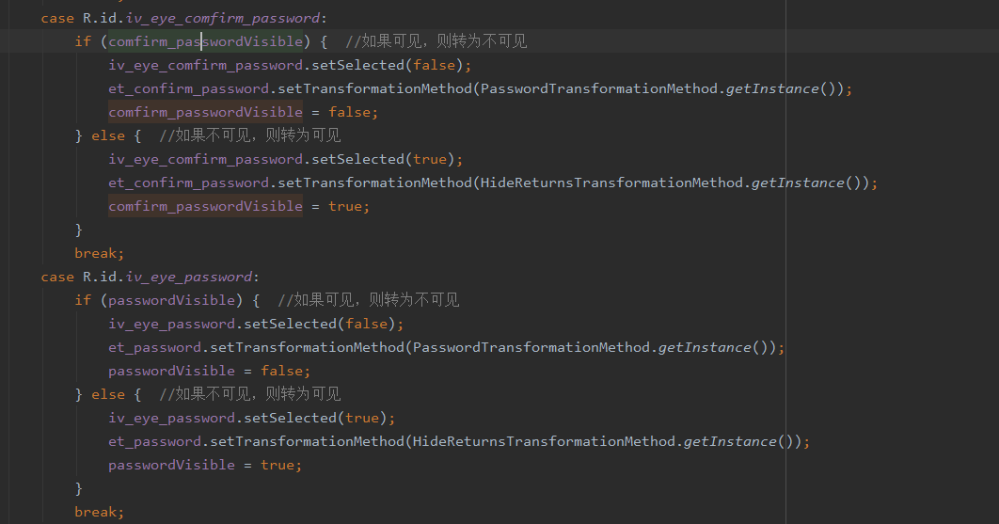
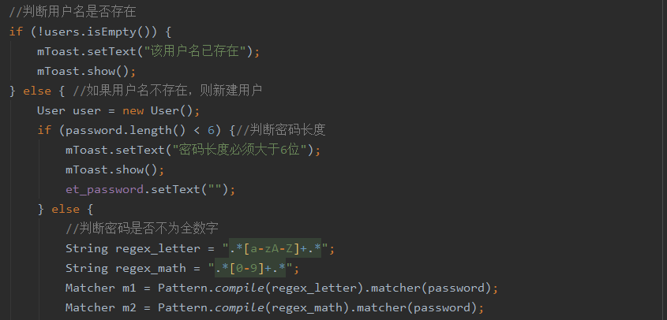
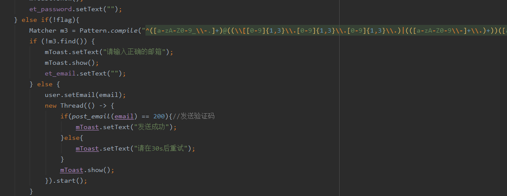
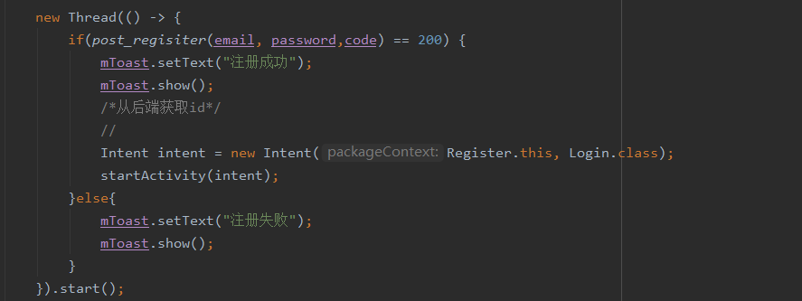
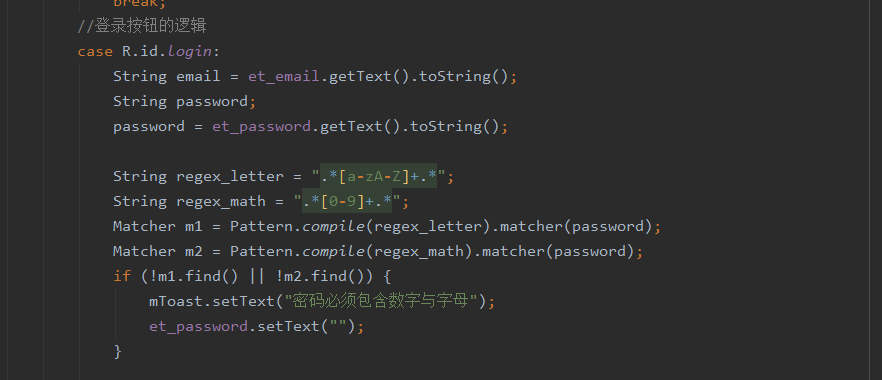
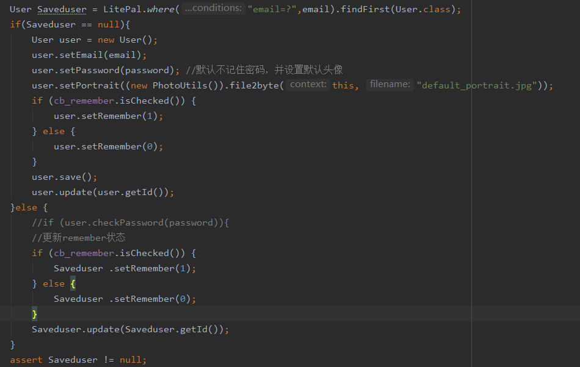
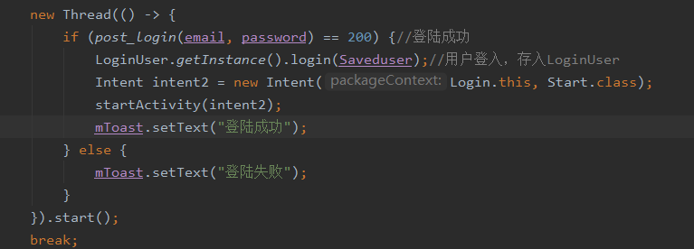
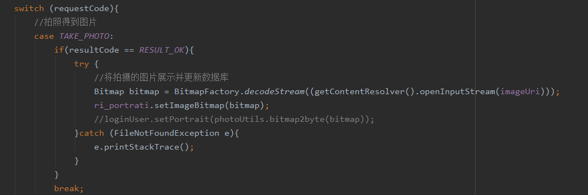
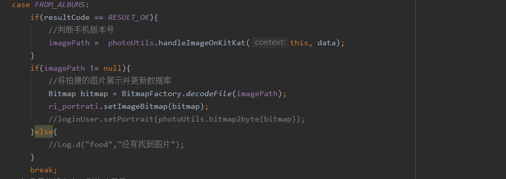

title: SchoolCircle校友圈——基于Android

author:
  - 傅嘉豪(1912190318)
  - 谷宁宁(1912190319)
  - 马辰杰(1912190320)

description: |

  我们开发了一个android app，实现校园内各种信息分享，
  前端使用Android studio开发，后端采用
  主要实现文字与图片以帖子形式分享以及一些其他功能（后续文档中详细介绍）

# 一、项目介绍 [傅嘉豪、谷宁宁、马辰杰]

## 背景
这是一个包含交友、记录等功能的校园类社交APP。目前网络上的论坛五花八门，各种功能的论坛应应有尽有，但是我们发现很多关于校内的信息获取我们往往要通过一些人运营的微信号来发布，如果有的人没有添加这些微信号，那他可能就会错过一些对他有用的信息。所以我们希望开发一个app来 帮助同学们发布意见获取一些信息 。例如清理自己的闲置物品就可以在上面发布帖子，企业在招聘时也可以在论坛上发布自己的招聘信息 ，同学们在论坛上也可以更方便的找到适合自己的工作信息，也可以直接私信企业账号了解到更多的信息。

## 项目需求分析

介绍项目主要有哪些功能需求，需要实现什么样的功能。可以结合思维导图、用例图等进行说明。
  
1. 登录注册功能：每个用户需要一个账号来登录并使用我们的系统，第一次进入系统可以使用邮箱来注册账号再登录系统使用，后续可以直接登录。
2. 发帖功能：在发帖页面添加帖子相关的信息，主要是三个内容，标题、内容以及配图，同时在发布页面选择自己的目标分区，你的帖子会在相关分区显示。配图可以选择不添加也可以选择拍摄或者从相册选取。
3. 看帖功能：在首页可以选择想看的分区，也可以选择全区展示所有的帖子，点击帖子标题可以进入帖子详情，对帖子进行点赞或者评论。
4. 私聊及关注功能：点击发帖人头像，可以进入该用户的个人界面，选择关注可以将该用户添加到你的关注列表中，选择私聊进入私聊页面，可以给该用户发送信息。
5. 消息：分为两个模块，通知以及私聊，通知模块显示系统的通知，私聊模块显示你与其他人的私聊记录，点击可以进入与该用户的私聊界面。
6. 个人信息功能：在“我的”一栏中可以看到自己的个人信息，也可以对个人信息进行修改，具体个人信息有：头像，用户名，邮箱，id，地址，性别，生日。

## 计划和分工

### 1、开发计划
本项目采用前后端分离的设计。

关于前端，我们首先对需求进行分析，分析出具体的各种需求，根据需求我们画出了原型，确定好系统架构之后在android studio上实现出具体的layout，通过对控件以及其他函数的调用实现从数据库取得数据并显示。
关于后端，
### 2、分工
界面原型设计：谷宁宁、马辰杰

功能模块确定及划分：傅嘉豪、谷宁宁、马辰杰

系统架构：傅嘉豪、谷宁宁、马辰杰

前端相关实现：谷宁宁、马辰杰

后端实现及数据库：傅嘉豪

系统测试及部署：傅嘉豪

文档撰写：傅嘉豪、谷宁宁、马辰杰

# 二、界面原型设计 [谷宁宁、马辰杰]

根据前面的功能需求分析，分模块介绍每部分的原型设计。包括界面的具体细节、跳转关系以及实现说明等。

此部分应按照模块来进行组织，比如第一部分用户管理，其中包含了用户登录、注册、信息查看、修改等等，把这部分的界面设计及跳转关系统一放在一张图上。

除了设计图之外，应该用语言详细说明自己的设计理念，为什么要这么设计，有什么优缺点，实现的难度如何等等。

1. 用户管理

在这部分，主要是实现用户管理的功能，在进入系统之后首先是显示登录界面，同时考虑已注册用户和未注册用户，我们将注册的选项也放在该页面，在注册成功之后会返回登录界面进行登录，登录成功首先显示的就是首页，因为本系统最主要的功能就是同学们所以分享的信息，对于使用本系统的用户，详细获取相关的信息也是他们最主要的目的，所以我们决定将登陆成功后进入的页面确定为首页。在进入首页后，用户如果想要查看自己的个人信息，点击‘我的’一栏点击头像就可以查看自己的个人信息，该部分我们的设计参考微信的设计，所以的个人信息一个个排列，一目了然，如果想要修改其中某个信息只需要点击对应的信息即可。
2. 查看帖子

在这部分，主要是实现查看帖子的功能，因为有些帖子的内容可能过多，如果直接在首页展示，极有可能一整页的屏幕都不能完整显示一条帖子，这会极大影响用户观感，所以我们在首页只显示图片以及帖子标题，当用户对该帖子感兴趣时，可以点击进入帖子详情界面，详情界面会显示此条帖子的点赞以及评论，评论采用盖楼式，每个用户所发的评论分条显示，评论不在首页显示也是同理怕占用过多的空间导致用户体验变差。
同时如果用户对某条帖子的发布者感兴趣，可以点击该用户头像进入该用户的用户信息界面，可以看到该用户的一些公开信息，可以选择关注，也可以选择私聊该用户，点击私聊会进入私聊界面，可以给该用户发送消息。
3. 发帖

在导航栏的第三个部分是发帖界面，在发帖界面，添加完标题以及内容后，可以选择是否添加图片，如果选择添加图片，点击添加图片，会有一个弹窗，可以选择相机拍摄或者从相册里选择，一开始我们并没有拍摄这个选项，但是我们设想了一下使用场景，也许会有用户希望分享实时的情况，也就是说该用户的相册里并没有他希望分享的图片，所以我们提供了调用摄像头这样的选择。在所有内容填写完毕后，点击发帖，会跳转到主界面，此用户刚分享的帖子会显示在最上方，因为本系统所以帖子是按照时间顺序来展示的。之所以展示在最上方，是因为我们希望用户在发送完帖子的第一时刻可以看到自己发送的帖子在系统中展示的样子。
4. 消息

   
   
   在导航栏的第二个部分是消息界面，点击通知会显示通知，通知内容主要是一些系统通知，点击私聊进入私聊界面，所有私聊按照时间顺序排列方便用户锁定需要的私聊。

## 具体原型设计展示

# 三、系统架构设计 [傅嘉豪、马辰杰、谷宁宁]

## 1.系统整体架构
- 应用层：开发的应用程序 和安卓的核心应用程序是同一层次的，基于安卓的系统api来构建。
- 应用框架层：使用安卓所提供的一些API 我们可以访问核心应用程序使用的API框架，通过提供开放的开发平台，我们可以根据我们的需要来调用系统api而不用自己另外编写，仅仅使用系统api就可以实现许多功能。
- 系统运行库层：AS提供的库来支持运行 Android 包含一个核心库的集合，该核心库提供了 Java 编程语言核心库的大多数功能。几乎每一个 Android 应用程序都在自己的进程中运行，都拥有一个独立的 Dalvik 虚拟机实例。
- 后端框架：Spring cloud
- 数据层：JPA和Mybatis
- 数据库：MySQL
## 2.前端包含模块
- 登录注册模块
  
  登录注册模块主要实现用户的登录注册功能，登录和注册是分开来的两块，当注册成功后会将此模块绑定个人信息模块，对于一些必要的字段系统会给出默认值为空，在安卓端使用了okhttp框架来请求服务器数据。
- 个人信息模块

  在个人信息模块会有一些可供用户自己设置的属性，譬如生日、地址、性别等。当注册成功时，此模块也会生成一条记录来保存用户的个人信息，并对应登录注册模块，此处也是使用okhttp框架来请求服务器数据。
- 发帖模块
  
  在发帖模块同样与登录注册模块中通过一个用户uid来对应，发帖时用户可以选择同时分享图片，选择的图片可以显示在当前界面的一个imageview上，采用了Glide框架实现将用户选择的图片加载到imageview上。
- 私聊模块

  用户可以选择自己感兴趣的用户进行私聊，会展示对应的用户的个人信息，也是调用了该用户的个人信息模块对此用户进行展示，同时私聊的记录会展示在消息模块中。在私聊中使用Android studio的RecyclerView来实现聊天记录的展示。
- 消息模块

  消息模块包括通知以及私聊，通知就是一些系统通知，而私聊就会将该用户私聊模块中的记录显示到此处，记录按照时间顺序排列。使用okhttp框架来请求服务器数据，并将请求到的数据展示到相对应的控件上。
- 帖子模块

  帖子模块会记录所有的帖子信息，这块分成看帖和发帖，首先是发帖部分，发帖时会将这种信息一条条存储，同时一条帖子对应一个用户，也就是登录注册模块中创建的记录。看帖则是将所有用户发布的所有帖子信息展示在对应的分区中，在发帖模块中对每条帖子进行对用户的标记，同时对分区也进行标记。发帖时选择拍摄则调用对应api来实现调用系统摄像头。
## 3.后端包含模块

# 四、API设计 [傅嘉豪、谷宁宁、马辰杰]

这部分主要是API的设计，分模块进行介绍，并通过APIfox介绍API的设计理念，使用、测试方法等。用列表和文档对所有的API进行详细的列举和描述。

确定本系统需要的所有api
- 用户管理
- 聊天所需api
- 帖子所需api
- 关注所需api [傅嘉豪、谷宁宁、马辰杰]

api详细介绍
### 用户管理

### 聊天

### 帖子

### 关注

# 五、数据库设计 [傅嘉豪]

这部分主要是数据库方面的设计。

首先，详细描述自己系统中需要持久化的数据以及需要缓存的数据等，根据数据的特点确定自己的数据库方案（采用什么数据库及其原因）。

其次，结合ER图、列表等对自己的数据库中的数据进行详细描述，都有哪些表，保存了哪些数据，为什么要这么设计。

最后，详细描述所使用的数据库相关技术，比如ORM、工具以及具体的使用方式。

# 六、Android app端的实现 [谷宁宁、马辰杰]

这部分分模块来描述前端的具体实现，比如：

## 6.1 用户管理的实现

这部分是用户管理模块，如登录、注册、修改等功能的具体实现。这里应该重点将实现时考虑的因素，使用的算法以及这样做的优缺点，最后可以通过界面的截图来展示实现效果。

1. 新用户注册

   在用户登录注册界面点击注册进入到该界面，此界面共有四个输入框，一个让用户输入邮箱用于注册，一个用来输入验证码，一个用来输入密码，一个用来确认密码。首先输入邮箱以及密码，点击发送验证码，如果密码和邮箱没有问题，则会有一个发送成功的弹窗，关于验证密码是否正确以及显示和隐藏密码的具体实现如下：
  
  使用一个switch语句来选择隐藏或者显示，如果当下是隐藏的，那么就会判断，有一个点击动作并且当下是隐藏的，那么转为相反的状态，如果当下是显示出来的，和之前的逻辑相同将之转换为相反的状态。
  
  
  同样的，按照优先级分别对几个要求用多个if else来实现，首先判断用户名是否存在，如果不存在则近如下一级，密码长度需要大于六位，并且密码不能只有数字，需要同时有数字和字母。如果面及用户名全都符合要求，再往下继续判断用户所输入的邮箱是否正确，正确则弹窗‘发动成功’。
  
  在此处发送验证码，用户收到验证码后，在输入框中输入验证码，如果正确，则会弹窗注册成功，同时将用户的注册信息发送到服务器并存储，同时返回登录界面进行登录。
2. 用户登录
   用户在此页面输入邮箱以及密码，匹配正确之后进入系统。具体实现如下：
  
  获取用户在text中输入的字符
  
  用户可以在此处选择记住密码，使用cb_remember.isChecked()来确认用户是否选择记住密码，此处也是使用多个if-else来实现逻辑。
  
  此处调用api，将用户输入的email和password发送到服务器，服务器接受到请求会有返回值，如果配对成功，返回值为200，则匹配成功，用户会进入到主界面并且弹窗‘登录成功’，反之弹窗‘登录失败’，用户需要检查自己输入的信息是否正确并重新输入。
3. 修改密码
   用户如果忘记密码可以点击修改密码，本部分和注册账号是逻辑基本相同，也是输入自己的邮箱以及密码，并点击发送验证码，收到验证码后输入，如果没有问题则显示修改成功，关于具体实现与注册账号基本相同，在本部分不多加赘述。
4. 个人信息的修改
   在登录成功之后，用户在‘我的’一栏点击头像可以进入到自己的个人信息界面，选择相应的信息就可以进行修改，具体实现如下：
   
   本处也是使用一个switch循环来实现，共有以下几种情况：
   - case R.id.ig_region：修改地址，使用一个变量tx来存储地址，同时显示在对应的数据框中，在退出时将该处的修改保存到数据库中。
   - case R.id.ig_gender：修改性别，性别共有三种选项可控选择，分别是男、女以及保密，同样使用一个变量tx来存储性别，同时显示在对应的数据框中，在退出时将该处的修改保存到数据库中。
   - case R.id.ig_brithday：修改生日，在用户账号创建完毕时，会在对应的数据表中该用户的记录，但是生日信息刚开始为空，用户对此进行设置，打开时间选择器，如果不进行时间选择，那么系统会将当前时间设置为用户的生日，如果进行修改，则在数据库中对该用户的生日数据字段进行修改并保存。
   - case R.id.ig_name：修改用户名，点击修改用户名会跳转到修改名字的界面，读取用户在text中输入的信息并保存，点击保存之后将数据传输到服务器。
   - case R.id.ll_portrait：修改头像，如果点击修改头像，会调用show_popup_windows()展示选择框，用户可以选择在相机拍摄或者从相册选择图片
  
  调用函数将拍摄的图片展示在imageview中，同时更新数据库中该字段的信息。
  
  先判断用户手机的型号，再展示用户所选择的图片，同时更新数据库中该字段的信息。
   
  
## 6.2 发帖功能的实现

这部分主要讲点名功能的具体实现方案，可以通过用例图、流程图等来辅助说明。并通过截图来展示效果。

实现部分不要只有截图，要有文字说明，讲讲这部分实现时采用什么技术，优缺点是什么，实现难点在哪里。
1. 发帖
   
   用户在发帖界面可以选择发布自己想要分享的内容，主要内容为三块，分别是：标题、内容、以及配图。并且用户可以选择自己希望自己发布的内容所展示的分区。共有四大分区，分别是：全区、二手交易、表白、求职与活动。
   当用户填写完要分享的内容以及所要发布到的分区后，点击发帖。首先系统会进行判断是否有图片添加，此处有一个变量haveimg为1或0，1表示有图片，0表示没有，type表示分区，1、2、3、分别对应二手交易、表白、活动与求职。所有字段中除了imp，其他字段都是必须的，因为用户可以选择不上传图片。点击发帖后，如果没有问题会直接先将此条帖子记录上传至服务器存储，同时帖子中也有一个uid字段，用来定位发布该条动态的用户。发布成功后会跳转到帖子详情，用户也可以在发送成功之后到主界面查看自己的帖子。
2. 看帖
   
   在全区会显示所有帖子，而对应的分区则分别显示对应的帖子，在首页中直接调用findAll来查找所有的帖子，在拿到所有帖子的数据之后，得出数据的长度也就是帖子的数量n，循环n次，在循环中将得到的数据一一存放在textview_layout中，在home中有一个ViewPager控件，可以将所有的帖子展示在其中。对于有分区的帖子，则调用另一个接口findAllWithType来实现，调用这个接口需要传入一个参数，这个参数为1、2、3，,0表示这个帖子在全区展示，不做考虑，这个接口可以实现查找发布在此分区的所有帖子，展示的方法和全区的相同。显示图片使用Picasso来将url直接在imageview中显示出来。
3. 帖子收藏 
   
   在帖子详情界面，用户可以选择自己感兴趣的帖子进行收藏，每个帖子都有对应的uid以及tid，所以能每条帖子能对应到每个用户，tid用来标记每个帖子的编号，当用户选择收藏，系统记录下该条帖子的tid，在此用户的‘我的’一栏中，有收藏这个视图，所有此用户所收藏的帖子会在此处显示，系统根据tid在数据库中定位到此条帖子，调用checkFavourite可以检查用户是否收藏了该条帖子，如果是，则显示。
## 6.3 关注及私信功能的实现
1. 关注
2. 私信
# 七、点名后端的实现[傅嘉豪]

这部分也是分模块来展示后端的实现方案。具体参见前面第六部分。

# 八、系统测试[傅嘉豪、谷宁宁、马辰杰]

这部分主要讲系统的测试方案，不要简单贴图，要写出具体的自动测试方案。可以前后端分开来写。

## 8.1 单元测试

这部分是单元测试的方案，可以列表统计有多少测试，覆盖率是多少。

## 8.2 集成测试

## 8.3 测试部署及结果

这部分可以先如何部署到GitHub或其它系统，如何在开发时利用测试来保证正确率的，测试结果如何。

# 九、系统部署 [傅嘉豪]

这部分主要写系统的部署方案，采用了什么样的部署方案（docker？虚拟机？云平台？），有没有自动部署等方案以及具体的步骤和使用方法。

# 十、功能展示 [傅嘉豪、谷宁宁、马辰杰]

基本的功能展示，可以用视频来展示。如果贴图，请尽量将相同模块的图拼接在一起以减少空间占用。

# 十一、清单 [傅嘉豪、谷宁宁、马辰杰]

这部分列出项目提交的清单，如：

- 前端代码: wx_class项目
- 后端代码: class_backend项目
- 原型设计文件: docs/design目录
- 项目演示视频: docs/videos目录
- ……

# 十二、总结 [傅嘉豪、马辰杰、谷宁宁]

项目的总结，整个项目的感受以及下一步的计划。

# 十二、参考文献 [傅嘉豪、马辰杰、谷宁宁]

系统所参考的文献或者代码，比如：

- Android开发文档：https://developer.android.google.cn/
- okthhp：https://blog.csdn.net/qq_29882585/article/details/111870887
- Picasso：https://blog.csdn.net/Wtoria/article/details/51985401