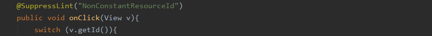
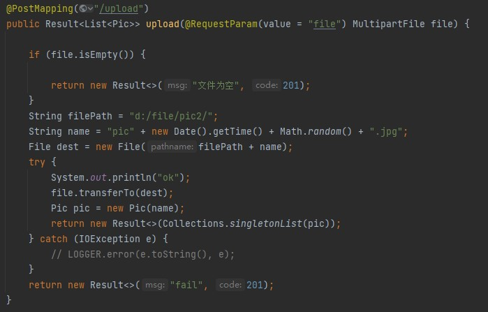

title: SchoolCircle校友圈——基于Android

author:
  - 傅嘉豪(1912190318)
  - 谷宁宁(1912190319)
  - 马辰杰(1912190320)

description: |

  我们开发了一个android app，实现校园内各种信息分享，
  前端使用Android studio开发，后端采用
  主要实现文字与图片以帖子形式分享以及一些其他功能（后续文档中详细介绍）


# 一、项目介绍 [傅嘉豪、谷宁宁、马辰杰]

## 背景
这是一个包含交友、记录等功能的校园类社交APP。目前网络上的论坛五花八门，各种功能的论坛应应有尽有，但是我们发现很多关于校内的信息获取我们往往要通过一些人运营的微信号来发布，如果有的人没有添加这些微信号，那他可能就会错过一些对他有用的信息。所以我们希望开发一个app来 帮助同学们发布意见获取一些信息 。例如清理自己的闲置物品就可以在上面发布帖子，企业在招聘时也可以在论坛上发布自己的招聘信息 ，同学们在论坛上也可以更方便的找到适合自己的工作信息，也可以直接私信企业账号了解到更多的信息。


## 项目需求分析

介绍项目主要有哪些功能需求，需要实现什么样的功能。可以结合思维导图、用例图等进行说明。

  

1. 登录注册功能：每个用户需要一个账号来登录并使用我们的系统，第一次进入系统可以使用邮箱来注册账号再登录系统使用，后续可以直接登录。
2. 发帖功能：在发帖页面添加帖子相关的信息，主要是三个内容，标题、内容以及配图，同时在发布页面选择自己的目标分区，你的帖子会在相关分区显示。配图可以选择不添加也可以选择拍摄或者从相册选取。
3. 看帖功能：在首页可以选择想看的分区，也可以选择全区展示所有的帖子，点击帖子标题可以进入帖子详情，对帖子进行点赞或者评论。
4. 私聊及关注功能：点击发帖人头像，可以进入该用户的个人界面，选择关注可以将该用户添加到你的关注列表中，选择私聊进入私聊页面，可以给该用户发送信息。
5. 消息：分为两个模块，通知以及私聊，通知模块显示系统的通知，私聊模块显示你与其他人的私聊记录，点击可以进入与该用户的私聊界面。
6. 个人信息功能：在“我的”一栏中可以看到自己的个人信息，也可以对个人信息进行修改，具体个人信息有：头像，用户名，邮箱，id，地址，性别，生日。


## 计划和分工

### 1、开发计划
本项目采用前后端分离的设计。

关于前端，我们首先对需求进行分析，分析出具体的各种需求，根据需求我们画出了原型，确定好系统架构之后在android studio上实现出具体的layout，通过对控件以及其他函数的调用实现从数据库取得数据并显示。
关于后端，
### 2、分工
界面原型设计：谷宁宁、马辰杰

功能模块确定及划分：傅嘉豪、谷宁宁、马辰杰

系统架构：傅嘉豪、谷宁宁、马辰杰

前端相关实现：谷宁宁、马辰杰

后端实现及数据库：傅嘉豪

系统测试及部署：傅嘉豪

文档撰写：傅嘉豪、谷宁宁、马辰杰

# 二、界面原型设计 [谷宁宁、马辰杰]

根据前面的功能需求分析，分模块介绍每部分的原型设计。包括界面的具体细节、跳转关系以及实现说明等。

此部分应按照模块来进行组织，比如第一部分用户管理，其中包含了用户登录、注册、信息查看、修改等等，把这部分的界面设计及跳转关系统一放在一张图上。

除了设计图之外，应该用语言详细说明自己的设计理念，为什么要这么设计，有什么优缺点，实现的难度如何等等。

1. 用户管理
   


在这部分，主要是实现用户管理的功能，在进入系统之后首先是显示登录界面，同时考虑已注册用户和未注册用户，我们将注册的选项也放在该页面，在注册成功之后会返回登录界面进行登录，登录成功首先显示的就是首页，因为本系统最主要的功能就是同学们所以分享的信息，对于使用本系统的用户，详细获取相关的信息也是他们最主要的目的，所以我们决定将登陆成功后进入的页面确定为首页。在进入首页后，用户如果想要查看自己的个人信息，点击‘我的’一栏点击头像就可以查看自己的个人信息，该部分我们的设计参考微信的设计，所以的个人信息一个个排列，一目了然，如果想要修改其中某个信息只需要点击对应的信息即可。
1. 查看帖子
   


在这部分，主要是实现查看帖子的功能，因为有些帖子的内容可能过多，如果直接在首页展示，极有可能一整页的屏幕都不能完整显示一条帖子，这会极大影响用户观感，所以我们在首页只显示图片以及帖子标题，当用户对该帖子感兴趣时，可以点击进入帖子详情界面，详情界面会显示此条帖子的点赞以及评论，评论采用盖楼式，每个用户所发的评论分条显示，评论不在首页显示也是同理怕占用过多的空间导致用户体验变差。
同时如果用户对某条帖子的发布者感兴趣，可以点击该用户头像进入该用户的用户信息界面，可以看到该用户的一些公开信息，可以选择关注，也可以选择私聊该用户，点击私聊会进入私聊界面，可以给该用户发送消息。
1. 发帖
   


在导航栏的第三个部分是发帖界面，在发帖界面，添加完标题以及内容后，可以选择是否添加图片，如果选择添加图片，点击添加图片，会有一个弹窗，可以选择相机拍摄或者从相册里选择，一开始我们并没有拍摄这个选项，但是我们设想了一下使用场景，也许会有用户希望分享实时的情况，也就是说该用户的相册里并没有他希望分享的图片，所以我们提供了调用摄像头这样的选择。在所有内容填写完毕后，点击发帖，会跳转到主界面，此用户刚分享的帖子会显示在最上方，因为本系统所以帖子是按照时间顺序来展示的。之所以展示在最上方，是因为我们希望用户在发送完帖子的第一时刻可以看到自己发送的帖子在系统中展示的样子。
1. 消息

   
   
   在导航栏的第二个部分是消息界面，点击通知会显示通知，通知内容主要是一些系统通知，点击私聊进入私聊界面，所有私聊按照时间顺序排列方便用户锁定需要的私聊。

## 具体原型设计展示


# 三、系统架构设计 [傅嘉豪、马辰杰、谷宁宁]

## 1.系统整体架构
- 应用层：开发的应用程序 和安卓的核心应用程序是同一层次的，基于安卓的系统api来构建。
- 应用框架层：使用安卓所提供的一些API 我们可以访问核心应用程序使用的API框架，通过提供开放的开发平台，我们可以根据我们的需要来调用系统api而不用自己另外编写，仅仅使用系统api就可以实现许多功能。
- 系统运行库层：AS提供的库来支持运行 Android 包含一个核心库的集合，该核心库提供了 Java 编程语言核心库的大多数功能。几乎每一个 Android 应用程序都在自己的进程中运行，都拥有一个独立的 Dalvik 虚拟机实例。
- 后端框架：Spring cloud
- 数据层：JPA和Mybatis
- 数据库：MySQL
## 2.前端包含模块
- 登录注册模块
  
  登录注册模块主要实现用户的登录注册功能，登录和注册是分开来的两块，当注册成功后会将此模块绑定个人信息模块，对于一些必要的字段系统会给出默认值为空，在安卓端使用了okhttp框架来请求服务器数据。
- 个人信息模块

  在个人信息模块会有一些可供用户自己设置的属性，譬如生日、地址、性别等。当注册成功时，此模块也会生成一条记录来保存用户的个人信息，并对应登录注册模块，此处也是使用okhttp框架来请求服务器数据。
- 发帖模块
  
  在发帖模块同样与登录注册模块中通过一个用户uid来对应，发帖时用户可以选择同时分享图片，选择的图片可以显示在当前界面的一个imageview上，采用了Glide框架实现将用户选择的图片加载到imageview上。
- 私聊模块

  用户可以选择自己感兴趣的用户进行私聊，会展示对应的用户的个人信息，也是调用了该用户的个人信息模块对此用户进行展示，同时私聊的记录会展示在消息模块中。在私聊中使用Android studio的RecyclerView来实现聊天记录的展示。
- 消息模块

  消息模块包括通知以及私聊，通知就是一些系统通知，而私聊就会将该用户私聊模块中的记录显示到此处，记录按照时间顺序排列。使用okhttp框架来请求服务器数据，并将请求到的数据展示到相对应的控件上。
- 帖子模块

  帖子模块会记录所有的帖子信息，这块分成看帖和发帖，首先是发帖部分，发帖时会将这种信息一条条存储，同时一条帖子对应一个用户，也就是登录注册模块中创建的记录。看帖则是将所有用户发布的所有帖子信息展示在对应的分区中，在发帖模块中对每条帖子进行对用户的标记，同时对分区也进行标记。发帖时选择拍摄则调用对应api来实现调用系统摄像头。
## 3.后端包含模块

- 注册登录模块

    注册登录模块负责实现系统的注册登录功能和个人信息维护等。

- 广场模块

    广场模块是于维护贴文信息，评论信息，以及对贴文的点赞收藏等内容。

- 聊天模块

    聊天模块用于两个用户之间进行私聊，对聊天信息进行保存和维护

- 关注模块

    关注模块用于用户之间的社交关系的实现，包括添加关注，显示关注列表等接口

# 四、API设计 [傅嘉豪、谷宁宁、马辰杰]

这部分主要是API的设计，分模块进行介绍，并通过APIfox介绍API的设计理念，使用、测试方法等。用列表和文档对所有的API进行详细的列举和描述。

确定本系统需要的所有api
- 用户管理
- 聊天所需api
- 帖子所需api
- 关注所需api [傅嘉豪、谷宁宁、马辰杰]

api详细介绍
返回值约定

返回值格式

```json
{
  "code": 200,//200表示成功，其他皆为失败
  "msg": "success",//提示信息
  "data": [//data中一定是null或者一个列表，列表中有一项或者多项
    {
      "uid": 8,
      "email": "sunabrhh@foxmail.com",
      "token": "pE0CwzADLBYrrg9Thuei5g=="
    }
  ]
}
```


## register

### 发送验证码

POST /register/sendEmail

> Body 请求参数

```json
{
  "email": "string"
}
```

#### 请求参数

|名称|位置|类型|必选|说明|
|---|---|---|---|---|
|body|body|object| 否 |none|
|» email|body|string| 是 |邮箱|


### 注册

POST /register/reg

> Body 请求参数

```json
{
  "email": "sunabrhh@foxmail.com",
  "password": "123456",
  "pin": "123456"
}
```
#### 请求参数
|名称|位置|类型|必选|说明|
|---|---|---|---|---|
|body|body|object| 否 |none|
|» email|body|string| 是 |邮箱|
|» password|body|string| 是 |密码|
|» pin|body|string| 是 |验证码|
> 返回示例
> 
> 成功

```json
{
  "code": 200,
  "msg": "success",
  "data": [
    {
      "uid": 8,
      "email": "sunabrhh@foxmail.com",
      "token": "pE0CwzADLBYrrg9Thuei5g=="
    }
  ]
}
```
### 上传头像

POST /register/upload


#### 请求参数

|名称|位置|类型|必选|说明|
|---|---|---|---|---|
|body|body|object| 否 |none|
|» file|body|string(binary)| 否 |none|

> 返回示例
无


### 设置用户信息

POST /register/resetUserInfo

> Body 请求参数

```json
{
  "uid": "string",
  "token": "string",
  "uname": "string",
  "phone": "string",
  "qq": "string",
  "wechat": "string",
  "sex": "string",
  "college": "string",
  "img": "string"
}
```

#### 请求参数

|名称|位置|类型|必选|说明|
|---|---|---|---|---|
|body|body|object| 否 |none|
|» uid|body|string| 是 |none|
|» token|body|string| 是 |none|
|» uname|body|string| 否 |用户名|
|» phone|body|string| 否 |电话|
|» qq|body|string| 否 |none|
|» wechat|body|string| 否 |微信|
|» sex|body|string| 否 |性别|
|» college|body|string| 否 |学院|
|» img|body|string| 否 |图片|

> 返回示例

> 成功

```json
{
  "code": 200,
  "msg": "success",
  "data": [
    {
      "uid": 2,
      "email": "166974372@qq.com",
      "uname": "住无常第交公细",
      "phone": "18685656531",
      "qq": "elit fugiat",
      "wechat": "in velit dolor",
      "sex": "女",
      "college": "nostrud adipisicing incididunt",
      "img": "demo.jpg"
    }
  ]
}
```


### 重置密码

POST /register/resetPassword

> Body 请求参数

```json
{
  "email": "string",
  "password": "string",
  "pin": "string"
}
```

#### 请求参数

|名称|位置|类型|必选|说明|
|---|---|---|---|---|
|body|body|object| 否 |none|
|» email|body|string| 是 |邮箱|
|» password|body|string| 是 |密码|
|» pin|body|string| 是 |验证码|

> 返回示例

> 成功
```json
{
  "code": 200,
  "msg": "success",
  "data": [
    {
      "uid": 8,
      "email": "sunabrhh@foxmail.com",
      "token": "pE0CwzADLBYrrg9Thuei5g=="
    }
  ]
}
```

### 登录

POST /register/login

> Body 请求参数

```json
{
  "pass": "123456",
  "email": "test"
}
```

#### 请求参数

|名称|位置|类型|必选|中文名|说明|
|---|---|---|---|---|---|
|body|body|object| 否 ||none|
|» email|body|string| 否 | 邮箱|none|
|» password|body|string| 否 | 密码|none|

> 返回示例

> 成功


```json
{
  "code": 200,
  "msg": "success",
  "data": [
    {
      "uid": 3,
      "email": "1669704372@qq.com",
      "token": "FCAVdBA+OFTKHUdpfGjS+Q=="
    }
  ]
}
```


### 获取头像

GET /register/images/demo.jpg

把demo.jpg换成读到的头像的文件名

> 返回示例
无


### 查询用户信息

POST /register/findUserInfoByUid

> Body 请求参数

```json
{
  "uid": "string"
}
```

#### 请求参数

|名称|位置|类型|必选|中文名|说明|
|---|---|---|---|---|---|
|body|body|object| 否 ||none|
|» uid|body|string| 是 ||none|

> 返回示例
> 成功

```json
{
  "code": 200,
  "msg": "success",
  "data": [
    {
      "uid": 2,
      "email": "166974372@qq.com",
      "uname": "书住复最动间",
      "phone": "19845070251",
      "qq": "laboris dolor occaecat",
      "wechat": "et nulla ea",
      "sex": "enim cillum irure voluptate",
      "college": "dolore mollit aliqua deserunt",
      "img": "demo.jpg"
    }
  ]
}
```


## chat

### 发消息

POST /chat/sendMessage

> Body 请求参数

```json
{
  "uid1": "string",
  "uid2": "string",
  "token": "string",
  "text": "string"
}
```

#### 请求参数

|名称|位置|类型|必选|中文名|说明|
|---|---|---|---|---|---|
|body|body|object| 否 ||none|
|» uid1|body|string| 是 ||none|
|» uid2|body|string| 是 ||none|
|» token|body|string| 是 ||none|
|» text|body|string| 是 ||none|

> 返回示例

> 成功
``` json
{
    "code": 200,
    "msg": "success",
    "data": [
        {
            "chat_id": 7,
            "uid_from": 2,
            "uid_to": 3,
            "text": "amet ullamco irure nisi",
            "time": "2022-06-09 22:59:01"
        }
    ]
}
```

### 获得聊天记录

POST /chat/getChat

> Body 请求参数

```json
{
  "uid1": "string",
  "uid2": "string",
  "token": "string"
}
```

#### 请求参数

|名称|位置|类型|必选|中文名|说明|
|---|---|---|---|---|---|
|body|body|object| 否 ||none|
|» uid1|body|string| 是 ||none|
|» uid2|body|string| 是 ||none|
|» token|body|string| 是 ||none|

> 返回示例

> 成功
``` json
{
    "code": 200,
    "msg": "success",
    "data": [
        {
            "chat_id": 1,
            "uid_from": 2,
            "uid_to": 3,
            "text": "213124",
            "time": "2022-04-15 15:31:27"
        },
        {
            "chat_id": 2,
            "uid_from": 3,
            "uid_to": 2,
            "text": "2141212512",
            "time": "2022-04-15 15:31:37"
        },
        {
            "chat_id": 3,
            "uid_from": 2,
            "uid_to": 3,
            "text": "cupidatat minim dolore",
            "time": "2022-04-18 15:16:13"
        },
        {
            "chat_id": 4,
            "uid_from": 2,
            "uid_to": 3,
            "text": "cupidatat minim dolore",
            "time": "2022-04-18 15:24:04"
        },
        {
            "chat_id": 5,
            "uid_from": 2,
            "uid_to": 3,
            "text": "re",
            "time": "2022-04-18 15:24:31"
        },
        {
            "chat_id": 6,
            "uid_from": 2,
            "uid_to": 3,
            "text": "9448949",
            "time": "2022-04-18 15:28:10"
        }
    ]
}
```

## playground

### 查看某人发的帖

POST /ground/findTweetByUid

不支持查看已经被删除的帖子，所有人都可以使用，不需要token

> Body 请求参数

```json
{
  "uid": "string"
}
```

#### 请求参数

|名称|位置|类型|必选|中文名|说明|
|---|---|---|---|---|---|
|body|body|object| 否 ||none|
|» uid|body|string| 是 ||用户id|

> 返回示例

> 成功

```json
{
  "code": 200,
  "msg": "success",
  "data": [
    {
      "tid": 1,
      "uid": 2,
      "time": "2022-04-22 13:30:46",
      "type": 1,
      "text": "21412412",
      "title": "测试title1",
      "have_img": 0,
      "img": null,
      "_alive": true
    },
    {
      "tid": 3,
      "uid": 2,
      "time": "2022-04-28 12:26:10",
      "type": 1,
      "text": "2141241",
      "title": "测试title3",
      "have_img": 0,
      "img": null,
      "_alive": true
    },
    {
      "tid": 4,
      "uid": 2,
      "time": "2022-04-28 12:44:39",
      "type": 1,
      "text": "1233211234567",
      "title": "测试title4",
      "have_img": 0,
      "img": null,
      "_alive": true
    },
    {
      "tid": 5,
      "uid": 2,
      "time": "2022-04-28 12:45:00",
      "type": 1,
      "text": "1233211234567",
      "title": "测试title5",
      "have_img": 0,
      "img": null,
      "_alive": true
    },
    {
      "tid": 7,
      "uid": 2,
      "time": "2022-06-01 11:24:47",
      "type": 1,
      "text": "sit proident",
      "title": "群构再军切格",
      "have_img": 0,
      "img": null,
      "_alive": true
    },
    {
      "tid": 8,
      "uid": 2,
      "time": "2022-06-01 11:31:08",
      "type": 1,
      "text": "cupidatat",
      "title": "何已这细",
      "have_img": 0,
      "img": null,
      "_alive": true
    },
    {
      "tid": 9,
      "uid": 2,
      "time": "2022-06-07 18:05:19",
      "type": 1,
      "text": "cupidata2t",
      "title": "何已这细",
      "have_img": null,
      "img": null,
      "_alive": true
    }
  ]
}
```


### 查看帖子

POST /ground/findAll

> 返回示例

> 成功

```json
{
  "code": 200,
  "msg": "success",
  "data": [
    {
      "tid": 1,
      "uid": 2,
      "time": "2022-04-22 13:30:46",
      "type": 1,
      "text": "21412412",
      "title": "测试title1",
      "have_img": 0,
      "img": null,
      "_alive": true
    },
    {
      "tid": 3,
      "uid": 2,
      "time": "2022-04-28 12:26:10",
      "type": 1,
      "text": "2141241",
      "title": "测试title3",
      "have_img": 0,
      "img": null,
      "_alive": true
    }
  ]
}
```


### 上传帖子图片

POST /ground/upload

> Body 请求参数

```yaml
file: file://C:\Users\daidai\Desktop\demo.jpg

```

#### 请求参数

|名称|位置|类型|必选|中文名|说明|
|---|---|---|---|---|---|
|body|body|object| 否 ||none|
|» file|body|string(binary)| 否 ||none|

> 返回示例

> 成功

```json
{
  "code": 200,
  "msg": "success",
  "data": [
    {
      "url": "pic16545966103160.9144097025479169.jpg"
    }
  ]
}
```


### 发帖

POST /ground/addTweet

> Body 请求参数

```json
{
  "uid": "string",
  "token": "string",
  "text": "string",
  "title": "string",
  "haveImg": "string",
  "img": "string",
  "type": "string"
}
```

#### 请求参数

|名称|位置|类型|必选|中文名|说明|
|---|---|---|---|---|---|
|body|body|object| 否 ||none|
|» uid|body|string| 是 ||发帖人的id|
|» token|body|string| 是 ||none|
|» text|body|string| 是 ||贴文内容|
|» title|body|string| 是 ||贴文标题|
|» haveImg|body|string| 是 ||0没有，1有|
|» img|body|string| 否 ||图片地址，先上传，再使用上传后的返回值|
|» type|body|string| 是 ||类型，数字|

> 返回示例

> 成功

```json
{
  "code": 200,
  "msg": "success",
  "data": [
    {
      "tid": 9,
      "uid": 2,
      "time": "2022-06-07 18:05:19",
      "type": 1,
      "text": "cupidata2t",
      "title": "何已这细",
      "have_img": null,
      "img": null,
      "_alive": true
    }
  ]
}
```

### 查看帖子下的评论

POST /ground/findCommentByTid

> Body 请求参数

```json
{
  "tid": "string"
}
```

#### 请求参数

|名称|位置|类型|必选|中文名|说明|
|---|---|---|---|---|---|
|body|body|object| 否 ||none|
|» tid|body|string| 是 ||帖子号|

> 返回示例

> 成功

```json
{
  "code": 200,
  "msg": "success",
  "data": [
    {
      "cid": 2,
      "uid": 3,
      "tid": 1,
      "text": "sint ad adipisicing",
      "time": "2022-04-28 12:48:13"
    },
    {
      "cid": 4,
      "uid": 3,
      "tid": 1,
      "text": "sint ad adipisicing1",
      "time": "2022-04-28 12:55:58"
    }
  ]
}
```

### 按照类型查看帖子

POST /ground/findAllWithType

> Body 请求参数

```json
{
  "type": "string"
}
```

#### 请求参数

|名称|位置|类型|必选|中文名|说明|
|---|---|---|---|---|---|
|body|body|object| 否 ||none|
|» type|body|string| 是 ||帖子类型|

> 返回示例

> 成功

```json
{
  "code": 200,
  "msg": "success",
  "data": [
    {
      "tid": 1,
      "uid": 2,
      "time": "2022-04-22 13:30:46",
      "type": 1,
      "text": "21412412",
      "title": "测试title1",
      "have_img": 0,
      "img": null,
      "_alive": true
    },
    {
      "tid": 3,
      "uid": 2,
      "time": "2022-04-28 12:26:10",
      "type": 1,
      "text": "2141241",
      "title": "测试title3",
      "have_img": 0,
      "img": null,
      "_alive": true
    }
  ]
}
```


### 查看自己的发帖

POST /ground/findMyTweet

查看自己的发帖，仅本人使用，uid和token同一，可以看到被删除的帖子，如果不需要被删除的帖子，请使用findTweetByUid

> Body 请求参数

```json
{
  "uid": "string",
  "token": "string",
}
```

#### 请求参数

|名称|位置|类型|必选|中文名|说明|
|---|---|---|---|---|---|
|body|body|object| 否 ||none|
|» uid|body|string| 是 ||none|
|» token|body|string| 是 ||none|

> 返回示例

> 成功
``` json
{
    "code": 200,
    "msg": "success",
    "data": [
        {
            "tid": 1,
            "uid": 2,
            "time": "2022-04-22 13:30:46",
            "type": 1,
            "text": "21412412",
            "title": "测试title1",
            "have_img": 0,
            "img": null,
            "_alive": true
        },
        {
            "tid": 3,
            "uid": 2,
            "time": "2022-04-28 12:26:10",
            "type": 1,
            "text": "2141241",
            "title": "测试title3",
            "have_img": 0,
            "img": null,
            "_alive": true
        }
    ]
}
```

### 查看某人的收藏

POST /ground/findFavouriteByUid

> Body 请求参数

```json
{
  "uid": "string",
  "token": "string"
}
```

#### 请求参数

|名称|位置|类型|必选|中文名|说明|
|---|---|---|---|---|---|
|body|body|object| 否 ||none|
|» uid|body|string| 是 ||none|
|» token|body|string| 是 ||none|

> 返回示例

> 成功

```json
{
  "code": 200,
  "msg": "success",
  "data": [
    {
      "fid": 1,
      "tid": 3,
      "uid": 2,
      "time": "2022-06-08 21:44:23",
      "is_alive": 1
    },
    {
      "fid": 2,
      "tid": 4,
      "uid": 2,
      "time": "2022-06-08 21:30:39",
      "is_alive": 1
    }
  ]
}
```


### 添加收藏

POST /ground/addFavourite

> Body 请求参数

```json
{
  "uid": "string",
  "tid": "string",
  "token": "string"
}
```

#### 请求参数

|名称|位置|类型|必选|中文名|说明|
|---|---|---|---|---|---|
|body|body|object| 否 ||none|
|» uid|body|string| 是 ||none|
|» tid|body|string| 是 ||none|
|» token|body|string| 是 ||none|

> 返回示例

> 成功

```json
{
  "code": 200,
  "msg": "收藏成功",
  "data": null
}
```


### 取消收藏

POST /ground/delFavourite

> Body 请求参数

```json
{
  "uid": "string",
  "tid": "string",
  "token": "string"
}
```

#### 请求参数

|名称|位置|类型|必选|中文名|说明|
|---|---|---|---|---|---|
|body|body|object| 否 ||none|
|» uid|body|string| 是 ||none|
|» tid|body|string| 是 ||none|
|» token|body|string| 是 ||none|

> 返回示例

> 成功

```json
{
  "code": 200,
  "msg": "取消关注成功",
  "data": null
}
```


### 检查某人是否收藏某贴

POST /ground/checkFavourite

> Body 请求参数

```json
{
  "uid": "string",
  "tid": "string"
}
```

#### 请求参数

|名称|位置|类型|必选|中文名|说明|
|---|---|---|---|---|---|
|body|body|object| 否 ||none|
|» uid|body|string| 是 ||none|
|» tid|body|string| 是 ||none|

> 返回示例

> 成功

```json
{
  "code": 200,
  "msg": "success",
  "data": [
    {
      "is_favourite": 1
    }
  ]
}
```


### 添加评论

POST /ground/addComment

> Body 请求参数

```json
{
  "uid": "string",
  "token": "string",
  "tid": "string",
  "text": "string"
}
```

#### 请求参数

|名称|位置|类型|必选|中文名|说明|
|---|---|---|---|---|---|
|body|body|object| 否 ||none|
|» uid|body|string| 是 ||评论者的id|
|» token|body|string| 是 ||none|
|» tid|body|string| 是 ||评论的帖子id|
|» text|body|string| 是 ||none|

> 返回示例

> 成功
``` json
{
    "code": 200,
    "msg": "success",
    "data": [
        {
            "cid": 5,
            "uid": 2,
            "tid": 3,
            "text": "sint ad adipisicing1",
            "time": "2022-06-09 23:08:28"
        }
    ]
}
```

### GET 获得图片

GET /ground/images/{url}

#### 请求参数

|名称|位置|类型|必选|中文名|说明|
|---|---|---|---|---|---|
|url|path|string| 是 ||none|

> 返回示例
无

## ship

### 关注列表

POST /ship/findFollowingByUid

返回传入的uid关注的人

> Body 请求参数

```json
{
  "uid": "string",
  "token": "string"
}
```

#### 请求参数

|名称|位置|类型|必选|中文名|说明|
|---|---|---|---|---|---|
|body|body|object| 否 ||none|
|» uid|body|string| 是 ||none|
|» token|body|string| 是 ||没啥用，但是传一下|

> 返回示例

> 成功
``` json
{
    "code": 200,
    "msg": "success",
    "data": [
        {
            "fid": 4,
            "followed": 4,
            "following": 3,
            "followTime": "2022-05-27 00:09:06",
            "followedMan": {
                "uid": 4,
                "email": "123456@qq.com",
                "uname": "游客1561561",
                "phone": null,
                "qq": null,
                "wechat": null,
                "sex": null,
                "college": null,
                "img": "demo.jpg"
            },
            "followingMan": {
                "uid": 3,
                "email": "1669704372@qq.com",
                "uname": "游客3378527",
                "phone": null,
                "qq": null,
                "wechat": null,
                "sex": null,
                "college": null,
                "img": "demo.jpg"
            }
        },
        {
            "fid": 6,
            "followed": 2,
            "following": 3,
            "followTime": "2022-05-27 00:12:37",
            "followedMan": {
                "uid": 2,
                "email": "166974372@qq.com",
                "uname": "住无常第交公细",
                "phone": "18685656531",
                "qq": "elit fugiat",
                "wechat": "in velit dolor",
                "sex": "女",
                "college": "nostrud adipisicing incididunt",
                "img": "demo.jpg"
            },
            "followingMan": {
                "uid": 3,
                "email": "1669704372@qq.com",
                "uname": "游客3378527",
                "phone": null,
                "qq": null,
                "wechat": null,
                "sex": null,
                "college": null,
                "img": "demo.jpg"
            }
        }
    ]
}
``` 


### 被关注列表

POST /ship/findFollowedByUid

返回关注传入uid的人的列表

> Body 请求参数

```json
{
  "uid": "string",
  "token": "string"
}
```

#### 请求参数

|名称|位置|类型|必选|中文名|说明|
|---|---|---|---|---|---|
|body|body|object| 否 ||none|
|» uid|body|string| 是 ||none|
|» token|body|string| 是 ||none|

> 返回示例

> 成功
``` json
{
    "code": 200,
    "msg": "success",
    "data": [
        {
            "fid": 3,
            "followed": 2,
            "following": 4,
            "followTime": "2022-05-27 00:08:49",
            "followedMan": {
                "uid": 2,
                "email": "166974372@qq.com",
                "uname": "住无常第交公细",
                "phone": "18685656531",
                "qq": "elit fugiat",
                "wechat": "in velit dolor",
                "sex": "女",
                "college": "nostrud adipisicing incididunt",
                "img": "demo.jpg"
            },
            "followingMan": {
                "uid": 4,
                "email": "123456@qq.com",
                "uname": "游客1561561",
                "phone": null,
                "qq": null,
                "wechat": null,
                "sex": null,
                "college": null,
                "img": "demo.jpg"
            }
        },
        {
            "fid": 6,
            "followed": 2,
            "following": 3,
            "followTime": "2022-05-27 00:12:37",
            "followedMan": {
                "uid": 2,
                "email": "166974372@qq.com",
                "uname": "住无常第交公细",
                "phone": "18685656531",
                "qq": "elit fugiat",
                "wechat": "in velit dolor",
                "sex": "女",
                "college": "nostrud adipisicing incididunt",
                "img": "demo.jpg"
            },
            "followingMan": {
                "uid": 3,
                "email": "1669704372@qq.com",
                "uname": "游客3378527",
                "phone": null,
                "qq": null,
                "wechat": null,
                "sex": null,
                "college": null,
                "img": "demo.jpg"
            }
        }
    ]
}
```

### 添加关注

POST /ship/addFollow

> Body 请求参数

```json
{
  "followed": "string",
  "following": "string",
  "token": "string"
}
```

#### 请求参数

|名称|位置|类型|必选|中文名|说明|
|---|---|---|---|---|---|
|body|body|object| 否 ||none|
|» followed|body|string| 是 ||被关注者|
|» following|body|string| 是 ||关注者|
|» token|body|string| 是 ||关注者token|

> 返回示例

> 成功
``` json
{
    "code": 200,
    "msg": "success",
    "data": [
        {
            "fid": 7,
            "followed": 3,
            "following": 2,
            "followTime": "2022-06-09 23:15:29",
            "followedMan": null,
            "followingMan": null
        }
    ]
}
```

### 取消关注

POST /ship/delFollow

> Body 请求参数

```json
{
  "followed": "string",
  "following": "string",
  "token": "string"
}
```

#### 请求参数

|名称|位置|类型|必选|中文名|说明|
|---|---|---|---|---|---|
|body|body|object| 否 ||none|
|» followed|body|string| 是 ||被关注者|
|» following|body|string| 是 ||关注者|
|» token|body|string| 是 ||关注者tkoen|

> 返回示例

> 成功
``` json
{
    "code": 200,
    "msg": "success",
    "data": null
}
```


# 五、数据库设计 [傅嘉豪]

## 数据库的选择

本项目选择的数据库是**MySQL**

版本：8.0.27

部署地址：10.21.234.99

端口：3306

数据库名：school_circle

## 数据库表的设计

### chat表

chat表负责存储两个人的聊天信息


chat_id作为主键，uid_from和uid_to分别是发送者的id和接收者的id，text字段存储聊天的内容，time字段存储时间


### comment表

comment表负责存储帖子下面的回复信息


cid作为主键记录评论的id，uid是评论者的id，tid是帖子的id，text是评论内容，time是发评论的时间，is_alive表示评论是存在

### favourite表

favourite表负责存储对帖子的收藏信息


fid作为主键标志记录的id，tid是帖子id，uid是收藏者的id，time记录收藏时间，is_alive用于乱删除


### follow

follow表存储两个用户之间的关注关系


其中followed是被关注者的id，following的关注者的id，f_time是关注的时间。每一次新的关注操作都有新的关注记录的产生，取消关注时将相对应的关注记录删除。


### tweet

tweet表存储帖子的信息


tid存储帖子号，uid存储发帖者id，time记录发帖时间，type记录帖子的类型，text记录帖子内容，is_alive记录帖子是否被删除，good_num记录帖子的点赞数，title记录帖子的标题，have_img记录帖子是否有图片，img记录图片名称供前端访问。


### user

user表存储用户的登录注册信息


uid是最重要的，是用户的id，password是经过加密离散化的用户密码，pin是注册和重置密码时用到的验证码，pin_time是验证码的有效期，默认为验证码发出后的10分钟内，email是邮箱，是用户的登录凭证。token在买一次登录时重新生成，进行用户权限验证。

### userInfo表

userInfo表用于存储用户的个人信息


其中uid与user表中的uid相同，表示一个用户的id，email是用户注册时的邮箱，从逻辑上是不可修改的，没有在项目中没有提供修改的相关接口。uname在初始时会自动随机生成，img是头像，在初始时会默认为demo.jpg，其他属性都是可供自由修改保存的属性。


# 六、Android app端的实现 [谷宁宁、马辰杰]

这部分分模块来描述前端的具体实现：

## 6.1 用户管理的实现

这部分是用户管理模块，如登录、注册、修改等功能的具体实现。这里应该重点将实现时考虑的因素，使用的算法以及这样做的优缺点，最后可以通过界面的截图来展示实现效果。

1. 新用户注册[马辰杰、谷宁宁]

   在用户登录注册界面点击注册进入到该界面，此界面共有四个输入框，一个让用户输入邮箱用于注册，一个用来输入验证码，一个用来输入密码，一个用来确认密码。首先输入邮箱以及密码，点击发送验证码，如果密码和邮箱没有问题，则会有一个发送成功的弹窗，关于验证密码是否正确以及显示和隐藏密码的具体实现如下：

  

  使用一个switch语句来选择隐藏或者显示，如果当下是隐藏的，那么就会判断，有一个点击动作并且当下是隐藏的，那么转为相反的状态，如果当下是显示出来的，和之前的逻辑相同将之转换为相反的状态。

  
  

  同样的，按照优先级分别对几个要求用多个if else来实现，首先判断用户名是否存在，如果不存在则近如下一级，密码长度需要大于六位，并且密码不能只有数字，需要同时有数字和字母。如果面及用户名全都符合要求，再往下继续判断用户所输入的邮箱是否正确，正确则弹窗‘发动成功’。
  

  在此处发送验证码，用户收到验证码后，在输入框中输入验证码，如果正确，则会弹窗注册成功，同时将用户的注册信息发送到服务器并存储，同时返回登录界面进行登录。
2. 用户登录[马辰杰]
   用户在此页面输入邮箱以及密码，匹配正确之后进入系统。具体实现如下：
  

  获取用户在text中输入的字符

  

  用户可以在此处选择记住密码，使用cb_remember.isChecked()来确认用户是否选择记住密码，此处也是使用多个if-else来实现逻辑。

  

  此处调用api，将用户输入的email和password发送到服务器，服务器接受到请求会有返回值，如果配对成功，返回值为200，则匹配成功，用户会进入到主界面并且弹窗‘登录成功’，反之弹窗‘登录失败’，用户需要检查自己输入的信息是否正确并重新输入。
3. 修改密码[马辰杰]
   用户如果忘记密码可以点击修改密码，本部分和注册账号是逻辑基本相同，也是输入自己的邮箱以及密码，并点击发送验证码，收到验证码后输入，如果没有问题则显示修改成功，关于具体实现与注册账号基本相同，在本部分不多加赘述。
4. 个人信息的修改[马辰杰、谷宁宁]
   在登录成功之后，用户在‘我的’一栏点击头像可以进入到自己的个人信息界面，选择相应的信息就可以进行修改，具体实现如下：

   

   本处也是使用一个switch循环来实现，共有以下几种情况：
   - case R.id.ig_region：修改地址，使用一个变量tx来存储地址，同时显示在对应的数据框中，在退出时将该处的修改保存到数据库中。
   - case R.id.ig_gender：修改性别，性别共有三种选项可控选择，分别是男、女以及保密，同样使用一个变量tx来存储性别，同时显示在对应的数据框中，在退出时将该处的修改保存到数据库中。
   - case R.id.ig_brithday：修改生日，在用户账号创建完毕时，会在对应的数据表中该用户的记录，但是生日信息刚开始为空，用户对此进行设置，打开时间选择器，如果不进行时间选择，那么系统会将当前时间设置为用户的生日，如果进行修改，则在数据库中对该用户的生日数据字段进行修改并保存。
   - case R.id.ig_name：修改用户名，点击修改用户名会跳转到修改名字的界面，读取用户在text中输入的信息并保存，点击保存之后将数据传输到服务器。
   - case R.id.ll_portrait：修改头像，如果点击修改头像，会调用show_popup_windows()展示选择框，用户可以选择在相机拍摄或者从相册选择图片
   - 
  

  调用函数将拍摄的图片展示在imageview中，同时更新数据库中该字段的信息。

  

  先判断用户手机的型号，再展示用户所选择的图片，同时更新数据库中该字段的信息。
   
  
## 6.2 发帖功能的实现

这部分主要讲点名功能的具体实现方案，可以通过用例图、流程图等来辅助说明。并通过截图来展示效果。

实现部分不要只有截图，要有文字说明，讲讲这部分实现时采用什么技术，优缺点是什么，实现难点在哪里。
1. 发帖[谷宁宁]
   
   用户在发帖界面可以选择发布自己想要分享的内容，主要内容为三块，分别是：标题、内容、以及配图。并且用户可以选择自己希望自己发布的内容所展示的分区。共有四大分区，分别是：全区、二手交易、表白、求职与活动。
   
   当用户填写完要分享的内容以及所要发布到的分区后，点击发帖。首先系统会进行判断是否有图片添加，此处有一个变量haveimg为1或0，1表示有图片，0表示没有，type表示分区，1、2、3、分别对应二手交易、表白、活动与求职。所有字段中除了imp，其他字段都是必须的，因为用户可以选择不上传图片。点击发帖后，如果没有问题会直接先将此条帖子记录上传至服务器存储，同时帖子中也有一个uid字段，用来定位发布该条动态的用户。发布成功后会跳转到帖子详情，用户也可以在发送成功之后到主界面查看自己的帖子。
2. 看帖[谷宁宁、马辰杰]
   
   

   在全区会显示所有帖子，而对应的分区则分别显示对应的帖子，在首页中直接调用findAll来查找所有的帖子，在拿到所有帖子的数据之后，得出数据的长度也就是帖子的数量n，循环n次，在循环中将得到的数据一一存放在textview_layout中，在home中有一个ViewPager控件，可以将所有的帖子展示在其中。

   
   

   对于有分区的帖子，则调用另一个接口findAllWithType来实现，调用这个接口需要传入一个参数，这个参数为1、2、3，,0表示这个帖子在全区展示，不做考虑，这个接口可以实现查找发布在此分区的所有帖子，展示的方法和全区的相同。显示图片使用Picasso来将url直接在imageview中显示出来。
3. 帖子收藏 []
   
   在帖子详情界面，用户可以选择自己感兴趣的帖子进行收藏，每个帖子都有对应的uid以及tid，所以能每条帖子能对应到每个用户，tid用来标记每个帖子的编号，当用户选择收藏，系统记录下该条帖子的tid，在此用户的‘我的’一栏中，有收藏这个视图，所有此用户所收藏的帖子会在此处显示，系统根据tid在数据库中定位到此条帖子，调用checkFavourite可以检查用户是否收藏了该条帖子，如果是，则显示相关信息。
4. 我的帖子[马辰杰、谷宁宁]

   在‘我的’一栏中，可以看见自己发的帖子，此处具体实现和看帖部分类似，首先调用findall获取所有的帖子，再利用循环将所有uid与该用户uid一致的帖子找出，并将帖子显示在界面上。
## 6.3 关注及私信功能的实现
1. 关注
2. 私信[谷宁宁、马辰杰]
   
   在用户个人信息界面，点击私信可以进入到与该用户的私信界面，在主界面中消息在Recycleview中显示，同时有一个Msg用来表示消息，用一个type来区分此条消息是发送的还是收到的，并且将收到的消息向左对齐，将发送的消息向右对齐，定义一个MsgAdapter适配器，在onCreateViewHolder()中将item布局加载进来，在点击发送按钮之后，如果编辑框不为空，则创建一个msg对象，并且调用适配器方法将发送的信息显示在布局中，同时将输入框清空。
   关于发送消息的定位对象，调用sendMessage接口实现，有两个uid分别为发送人以及接收人的uid，以及发送的内容。
# 七、点名后端的实现[傅嘉豪]

后端使用Spring cloud作为框架，以Nacos作为注册中心，Gateway作为网关，其余部分有注册登录模块，聊天模块，广场模块，关注模块。

## 注册中心（Nacos）

Nacos 是阿里开源的注册中心，Nacos提供了一组简单易用的特性集，帮助您快速实现动态服务发现、服务配置，路由转发等。

端口：8848

服务地址：localhost:8848/nacos

官方文档：https://nacos.io/zh-cn/docs/what-is-nacos.html


## 网关（Gateway）

在微服务架构中，每个服务都是一个可以独立开发和运行的模块，而一个完整的微服务架构由一系列独立运行的微服务组成。这就导致了每一个模块都有自己独立的接口地址，不同服务之间相互隔离，独立部署。

而网关的作用就是在前端和后端之间增加一个统一的交互地址，网关作为前端请求的入口，并对所有的请求进行转发。

端口号：8001

转发规则：

- /register/ 转发到登录注册模块
- /ground/ 转发到广场模块
- /chat/ 转发到聊天模块
- /ship/ 转发到关注模块


## 登录注册（Register）

登录注册模块主要负责维护用户的登录注册信息和用户的个人信息

该模块主要使用了 **JPA** 作为数据库持久层API

选用JPA的原因

- JPA 简单易用，集成方便 ,只需要引入依赖就可以使用。
- JPA的查询语言是面向对象而非面向数据库的，它以面向对象的自然语法构造查询语句，在大多数情况下不需要编写SQL语句就能进行数据库查询。
- JPA中能够支持面向对象的高级特性，如类之间的继承、多态和类之间的复杂关系，能够最大限度的使用面向对象的模型而不需要自行处理这些特性在关系数据库的持久化。

目录结构


Register模块分为三层，从下到上为repository层，service层，controller层

### repository层

repository层负责的是数据库连接相关的接口的实现，每一个类对应一张数据库的表，封装数据的查询、创建、更新、删除等逻辑，供service层调用


具体到某一个接口，例如UserRepository


- existsUserByEmail方法定义了一个数据库查询接口，查找查找数据库中的user表中是否有一条记录的email值为传入值
- findUserByEmail方法定义了接口实现查询数据库user表中email为传入值的记录
- existsUserByUid方法定义了接口实现查询数据库user表中是否存在uid为传入值的记录
- findUserByUid方法定义了接口实现查询数据库user表中uid为传入值的记录

### service层

service层主要负责业务模块的逻辑应用设计。

存放业务逻辑处理，也是一些关于数据库处理的操作，但不是直接和数据库打交道，对数据库的操作通过调用repository层的接口实现。

### controller层

controller层负责对外提供POST或者GET的接口，同时对传入的参数的非空判定

例如


开启了一个sendEmail接口，并对传入参数进行非空判定

### 具体功能实现

#### 注册功能实现

注册功能分为两部分**发送邮件**和**完成注册**

##### 发送邮件

发送邮件使用的是网易163邮箱的接口

在配置文件中配置邮箱相关信息，再使用Java自带的JavaMailSenderImpl类实现发送函数


##### 完成注册

完成注册则需要邮箱，密码，验证码，在controller层获得数据后后，在service层对参数进行验证，如果都符合则注册完成，并对密码加密进行加密保存。此处使用Md5对密码进行离散化，且加入用户的邮箱作为盐增加安全性，同时返回成功后的用户信息。


#### 登录功能实现

登录功能分为两部分，**完成登录**，**生成token**

用户每次登录时，先判断用户用法存在或者密码是否正确，如果正确则完成登录并生成新的token保存在数据库中。在token生成时带有当前时间的参数，保证了一个用户同一时间只能在一台设备中使用。


#### 重置密码功能实现

重置密码功能从逻辑上和注册功能差不多，先是发送邮件，重置验证码的有效期（默认为十分钟），然后在有效期内使用邮箱，验证码，和新密码登录即可重置密码。当然，在发邮件和重置密码之前会进行用户信息是否存在的验证，只有已经存在该用户，才能重置密码。

#### 用户信息相关功能的实现

用户信息中保存着用户的一些个人信息，如名称，邮箱等

##### 用户信息的创建

用户信息记录的创建是自动的，当新用户注册成功后，系统会自动生成一条用户信息，包含邮箱和用户名，其中邮箱是账号的基础，所有是固定的，不可修改的。用户名是随机生成的。而其他的用户信息都为空，用户头像为默认头像。


##### 用户信息修改

信息修改使用的逻辑是先从数据库获取对应的用户信息，对于前端传入参数进行修改，对于前端没有传入的参数保持原来的参数。再重新保存到数据库中，对数据库进行更新。

##### 用户信息查询

由于JPA的特性，信息查询只需要传入对应的参数就可以，检查完参数非空后，使用service调用userInfoRepository接口进行查询。

## 关注(Relationship)

关注模块主要负责的是处理用户之间的关注和被关注关系。

关注模块也使用了 **JPA** 作为数据库持久层API

同样分为三层


### 具体功能实现

#### 添加关注和取消关注功能的实现

关注和被关注是形影不离的，它们的信息共同存储在一张表follow中。

每次关注就向表中添加一条记录，取消关注就在表中删除一条记录，并。

同时每次关注之前都先验证是否有权限关注和是否已经关注，都符合条件后才能进行关注，取关同理。

#### 关注列表和被关注列表

关注列表和被关注列表时一个简单的查询，传入主体的uid，按照逻辑就可以返回关注列表和被关注列表。

## 广场(Playground)

广场模块主要负责的是发帖看帖回复等功能的实现

广场模块使用了MyBatis作为数据库持久层API

MyBatis的优点是

- **简单易学**：本身就很小且简单。没有任何第三方依赖，最简单安装只要两个jar文件+配置几个SQL映射文件易于学习，易于使用
- **灵活**：mybatis不会对应用程序或者数据库的现有设计强加任何影响。SQL写在xml里，便于统一管理和优化。通过SQL基本上可以实现我们不使用数据访问框架可以实现的所有功能，或许更多。
- **解除SQL与程序代码的耦合**：通过提供DAO层，将业务逻辑和数据访问逻辑分离，使系统的设计更清晰，更易维护，更易单元测试。SQL和代码的分离，提高了可维护性。

所有广场模块的结构也分为三层，但是不同的是，广场模块的最底层是DAO层而不是repository层


同时，按照mybatis的特性，在资源文件中存在mapper存放各类xml文件保存SQL语句

## DAO层

DAO的作用是封装对数据库的访问：增删改查，不涉及业务逻辑，只是达到**按某个条件获得指定数据**的要求。DAO层的每一个类对应数据库中的一张表，同时也有一个mapper中的xml文件与之对应。


### 具体功能实现

#### 发帖功能实现

##### 图片上传功能实现

由于帖子有可能带有图片，在发帖时需要实现图片上传和保存。

本项目采用的图片保存的方式是通过静态目录保存。再通过路径映射对保存在该静态目录下的图片进行访问

图片上传通过MultipartFile获得图片数据，再依靠当前时间戳和随机数生成一个新的图片名，并使用这个新的名称为图片命名且将名称返回。



##### 发帖实现

发帖包括帖子标题，帖子内容，帖子类型，帖子是否有图片和图片地址等信息。同时发帖时还有带有发帖人的id和token。

对传入参数先进行id和token的验证，再将数据保存为新的记录，同时保存时也会带上当前的时间戳。

#### 评论功能的实现

评论信息包括评论的帖子的id，评论者的id，评论者的token和评论内容。

对传入的参数进id和token进行验证，再将数据保存为新的记录添加到评论表comment中，同时保存时也会带上当前的时间戳。

#### 收藏和取消收藏功能的实现

收藏和取消收藏放在一起实现。

为了实现记录的有效利用，对每一条记录中都保存有一个is_alive属性，表明记录是否有效。

在收藏时，如果是第一次收藏，则新建一条收藏记录，并在记录中留下当前的时间戳。

在取消收藏时，将原来的收藏记录的is_alive属性置为false。

如果再次收藏，则将原来记录的is_alive属性更新为true，并更新时间戳。


#### 其他功能的实现

其他查询功能则是按照API文档的定义按照传入参数对数据库进行查询并返回。

##  聊天（Chat）

聊天模块主要负责用户之间进行消息发送和接收

聊天模块也是使用了MyBatis作为数据库持久层API，所有它也大致分为三层


### 具体功能实现

#### 信息发送功能实现

聊天信息保存在chat表中，其中保存了信息的发送者，接收者和发送时间

信息发送需要传输的信息是双方的id和发送者的token以及发送内容。

进行权限验证和用户存在验证后将发送的信息作为一条新纪录加上当前的时间戳保存到数据库中。


#### 信息查询功能的实现

信息查询功能需要传入双方的id和token。但是与其他查询功能的区别是，由于聊天信息双方都可以看到，所有传入的token为任意一方的token都可以通过权限验证


# 八、系统测试[傅嘉豪、谷宁宁、马辰杰]

## 后端测试

后端测试采用的是JUnit框架

JUnit 是一个**回归测试框架**，可以快速的实现单元测试

### 单元测试

单元测试使用@SpringBootTest注解和@RunWith(SpringRunner.class)注解进行，主要针对Repository层和DAO层

#### 查询类的单元测试

对于查询类的接口，单元测试时使用预期的数据和结果，当查询结果与预期不符时，输出错误信息


而对于插入或者删除类的接口，单元测试时使用

#### 插入或删除类的单元测试

对于插入或者删除类的单元测试，由于测试可能进行很多遍，为了保持数据库整洁，需要对其操作进行回滚


其中

@Transactional表示该方法整体为一个事务

@Rollback表示事务执行完回滚，支持传入一个参数value，默认true即回滚，false不回滚。

### 集成测试

集成测试同样使用@SpringBootTest注解和@RunWith(SpringRunner.class)注解进行，主要针对Service层

集成测试主要应对的是程序对于各种传入参数的不同应对情况

同样，对于可能对数据库就行修改的操作，要进行回滚


# 九、系统部署 [傅嘉豪]

这部分主要写系统的部署方案，采用了什么样的部署方案（docker？虚拟机？云平台？），有没有自动部署等方案以及具体的步骤和使用方法。

# 十、功能展示 [傅嘉豪、谷宁宁、马辰杰]

本项目支持多端部署，但是由于服务发现和服务调用是通过ip地址进行访问的，所以要求部署的多端能够相互通过ip直接访问。

## 部署平台

操作系统版本 Windows11 专业版 21H2 22000.675

CPU Intel(R) Core(TM) i5-9400 CPU @ 2.90GHz   2.90 GHz

内存 16G

## 部署地址

http://10.21.234.99

端口 8001

## 部署步骤

## 安装MySQL数据库，并创建school_circle库

school_circle库的SQL文件地址：https://github.com/SchoolCircle/docs/blob/main/DBD/school_circle.sql

### 对每个模块进行打包

使用MAVEN的package进行打包，将模块打包成jar文件


### 下载并解压nacos

下载地址https://github.com/alibaba/nacos/releases

解压到任意文件夹下都可

## 运行nacos

在命令行中运行nacos文件夹bin目录下的**startup.cmd**

运行命令 ``startup.cmd -m standalone``

### 运行各个模块

运行打包出来的各个模块的jar文件

运行命令 ``java -jar ***.jar``

## 部署结果


# 十一、清单 [傅嘉豪、谷宁宁、马辰杰]


- 前端代码: wx_class项目
- 后端代码: class_backend项目
- 原型设计文件: docs/design目录
- 项目演示视频: docs/videos目录
- ……

# 十二、总结 [傅嘉豪、马辰杰、谷宁宁]

项目的总结，整个项目的感受以及下一步的计划。

# 十二、参考文献 [傅嘉豪、马辰杰、谷宁宁]

系统所参考的文献或者代码：

- Android开发文档：https://developer.android.google.cn/
- okthhp：https://blog.csdn.net/qq_29882585/article/details/111870887
- Picasso：https://blog.csdn.net/Wtoria/article/details/51985401